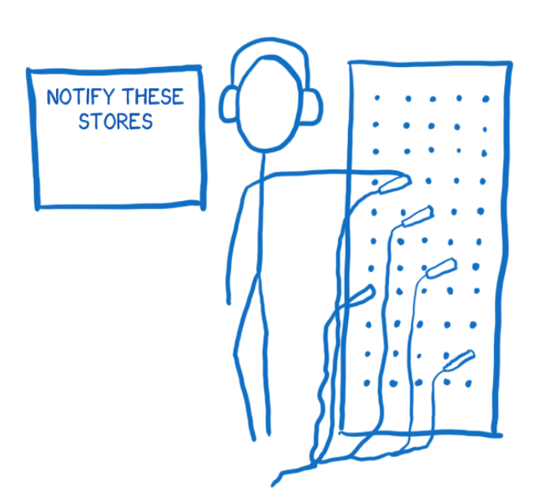
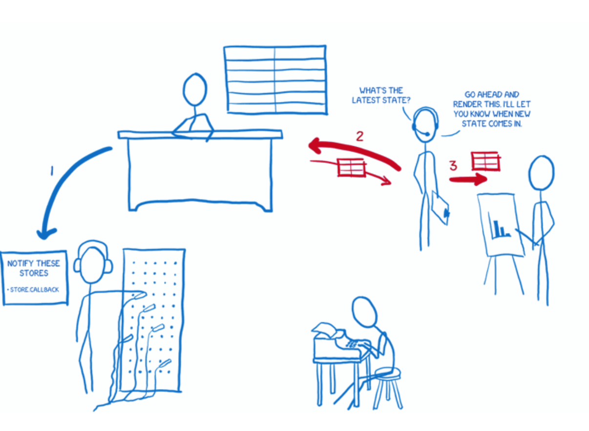
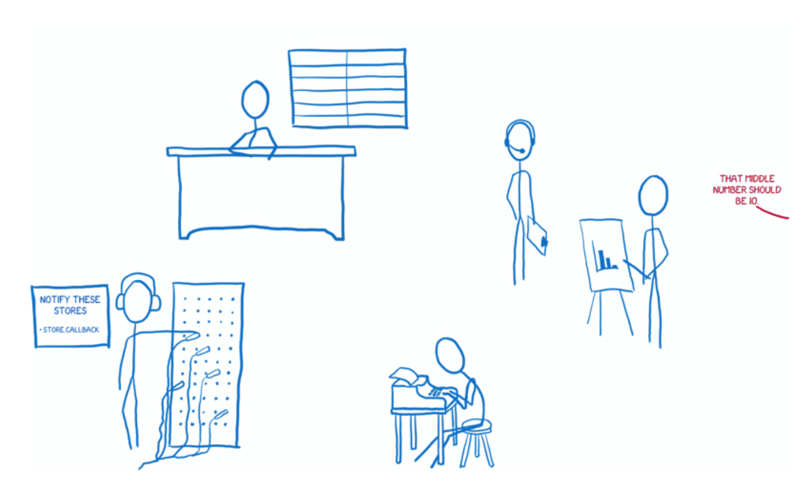
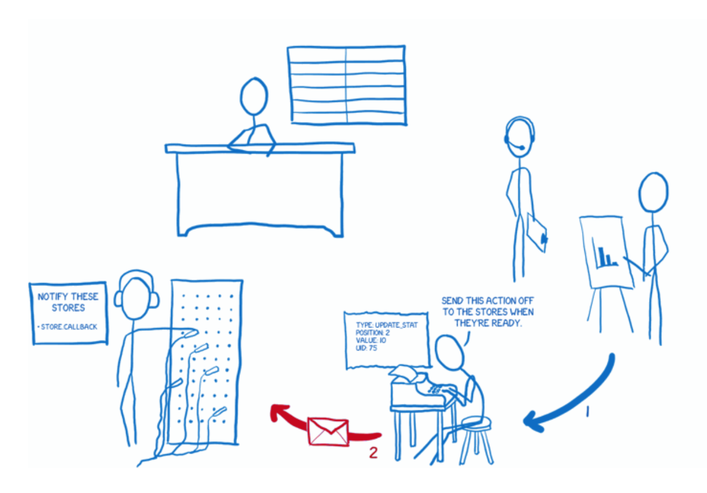

# Intro to Flux

Flux is both one of the most popular and one of the least understood topics in current web development. 

## The problem 

First, we should explain the basic problem that Flux solves. Flux is a pattern for handling data in your application. Flux and React grew up together at Facebook. Many people use them together, though you can use them independently. They were developed to address a particular set of problems that Facebook was seeing.

One really well known example of this set of problems was the notification bug. When you logged in to Facebook, you would see a notification over the messages icon. When you clicked on the messages icon, though, there would be no new message. The notification would go away. Then, a few minutes later after a few interactions with the site, the notification would come back. You'd click on the messages icon again… still no new messages. It would just keep going back-and-forth in this cycle.

It wasn’t just a cycle for the user on the site. There was also a cycle going on for the team at Facebook. They would fix this bug and everything would be fine for a while and then the bug would be back. It would go back-and-forth between being resolved and being an issue again.

So Facebook was looking for a way to get out of this cycle. They didn’t want to just fix it once. They wanted to make the system predictable so they could ensure that this problem wouldn’t keep resurfacing.

## The underlying problem 

The underlying problem that they identified was the way that the data flowed through the application.

_Note: this is what I’ve gleaned from simplified versions that they’ve shared in talks. I’m sure the actual architecture looked different._

Models pass data to the view layer.

They had models which held the data and would pass data to the view layer to render the data.

Because user interaction happened through the views, the views sometimes needed to update models based on user input. And sometimes models needed to update other models.

On top of that, sometimes these actions would trigger a cascade of other changes. I envision this as an edge-of-your-seat game of Pong — it’s hard to know where the ball is going to land \(or fall off the screen\).

Views update models. Models update other models. This starts to look like a really edge-of-your-seat game of Pong.

Throw in the fact that these changes could be happening asynchronously. One change could trigger multiple other changes. I imagine this as throwing a whole bag of ping-pong balls into your Pong game, with them flying all over the place and crossing paths.

All in all, it makes for a hard to debug data flow.

## The solution: unidirectional data flow 

So Facebook decided to try a different kind of architecture, where the data flows in one direction — only one direction — and when you need to insert new data, the flow starts all over again at the beginning. They called their architecture Flux.

The diagram you’ll find in Facebook’s Flux docs. It is way cooler than it looks.

This is actually really cool… but you probably can’t tell it from the diagram above.

Once you understand Flux, this diagram is pretty clear. The problem is that if you’re coming to the documentation completely new to Flux, I don’t think that this diagram helps you understand it… and that’s what a diagram should do. It should give you a big picture understanding of a system before you dive in to really start figuring out how you do specific things.

What helped me understand Flux better wasn’t a diagram like this, but instead thinking of the system in terms of different characters working together as a team to achieve a goal. So I want to introduce you to the cast of characters that I have in my head.

## Meet the characters 

I’m just going to give a quick introduction to the characters before I explain how they all interact.

### The action creator 

The first character is the action creator. It’s in charge of creating actions, which is the path that all changes and interactions should go through. Whenever you want to change the state of the app or have the view render differently, you shoot off an action.

The action creator is like a telegraph operator. It formats your message for you.

I think of the action creator as a telegraph operator. You go to the action creator knowing basically what message you want to send, and then the action creator formats that in a way that the rest of the system can understand.

The action creator creates an action with a type and a payload. The type will be one of the types that you have defined as actions in your system \(usually a list of constants\). An example of an action would be something like MESSAGE\_CREATE or MESSAGE\_READ.

There’s a neat side effect to having a part of your system that knows all of the possible actions. A new developer can come on the project, open up the action creator files and see the entire API — all of the possible state changes — that your system provides.

Once it has created the action message, the action creator passes that action off to the dispatcher.

### The dispatcher 

The dispatcher is basically a big registry of callbacks. It’s kind of like a telephone operator at a phone switchboard. It keeps a list of all of the stores that it needs to send actions to. When an action comes in from the action creator, it will pass the action around to different stores.

The dispatcher is like a switchboard operator. It knows all the callbacks for the different stores.

It does this in a synchronous way, which helps with that multi-ball Pong game effect that I was talking about earlier. And if you need to set up dependencies between stores so one gets updated before the other, you can have the dispatcher manage this for you with waitFor\(\).

The Flux dispatcher is different from dispatchers in many other architectures. The action is sent to all of the registered stores regardless of what the action type is. This means the store doesn’t just subscribe to some actions. It hears about all actions and filters out what it cares about and doesn’t.

### The store 

Next is the store. The store holds on to all state in the application, and all of the state changing logic lives inside of the stores.

The store is an over-controlling bureaucrat. All changes must go through it.

I think of the store as an over-controlling bureaucrat. All state changes must be made by it personally. And you can’t directly request that it change the state. There are no setters on the store. To request a state change, you must follow proper procedure… you must submit an action via the action creator/dispatcher pipeline.

As I mentioned above, if a store is registered with the dispatcher, all actions will be sent to it. Inside the store there’s usually a switch statement that looks at the action type to decide whether or not this store cares about this action. If the store does care about this action, it will figure out what change needs to be made based on this action and update the state.

Once the store has made its changes to the state, it will emit a change event. This will notify the controller view that the state has changed.

### The controller view and the view 

The views are in charge of taking the state and rendering it out for the user as well as accepting user input.

The controller view is like a middle manager who gets notifications from the store and passes the data onto the views under it. The view presents that data to the user.

The view is a presenter. It isn’t aware of anything in the application, it just knows the data that’s handed to it and how to format the data into output that people understand \(via HTML\).

The controller view is like a middle manager between the store and the view. The store tells it when the state has changed. It collects the new state and then passes the updated state along to all of the views under it.

## How they all work together 

So let’s take a look at how all of these characters work together.

### The setup 

First there’s the setup: application initialization which only happens once.

1. Stores let the dispatcher know that they want to be notified whenever an action comes in.

2. Then the controller views ask the stores for the latest state.

3. When the stores give the state to the controller views, they pass that state along to their child views to render.

4. The controller views also ask the stores to keep them notified when state changes.

### The data flow 

Once the setup is done, the application is ready to accept user input. So let’s trigger an action by having the user make a change.

We’ll kick off the data flow with a user interaction.

1. The view tells the action creator to prepare an action.

2. The action creator formats the action and sends it off to the dispatcher.

3. The dispatcher sends the action off to the stores in sequence. Each store gets notified of all actions. Then the store decides whether it cares about this one or not, and changes the state accordingly.

4. Once it’s done changing state, the store lets its subscribed view controllers know.

5. Those view controllers will then ask the store to give them the updated state.

6. After the store gives it the state, the view controller will tell its child views to rerender based on the new state.

So that’s how I think of Flux. Hope it helps!

