# Intro to Redux

One thing that causes even more confusion than Flux is the difference between Flux and Redux, a pattern that was inspired by Flux. 

## Why change Flux? 

Redux solves the same problems as Flux, plus some.

Just like Flux, it makes state changes in apps more predictable. If you want to change state, you have to fire off an action. There’s no way to change the state directly because the thing holding the state \(the store\) only has a getter, not setters. These basics of Flux and Redux are pretty similar.

So why a different pattern? Redux creator Dan Abramov saw an opportunity to improve on Flux. He wanted better developer tools. He saw that if you moved a couple of things around, you could make better developer tools possible, but still have the same predictability that Flux gives you.

He wanted hot reloading and time travel debugging. But there were some problems which made developer tooling hard to do with Flux.

### Problem 1: The code for stores can’t be reloaded without wiping out the state 

In Flux, the store contains two things:

1. The state change logic
2. The current state itself

Having these two on the same object is a problem for hot reloading. When you reload the store object to see the effect that the new state change logic has, you lose the state that the store is holding on to. Plus, you mess up the event subscriptions that tie the store to the rest of the system.

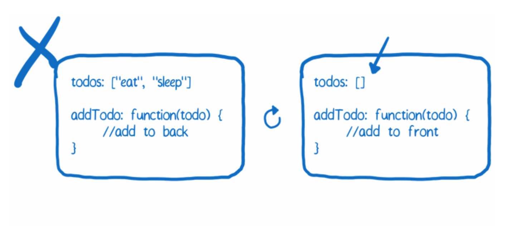

**Solution**  
Separate these two functions. Have one object that holds on to the state. This object doesn’t get reloaded. Have another object that contains all of the state change logic. This object can be reloaded because it doesn’t have to worry about holding on to any state.

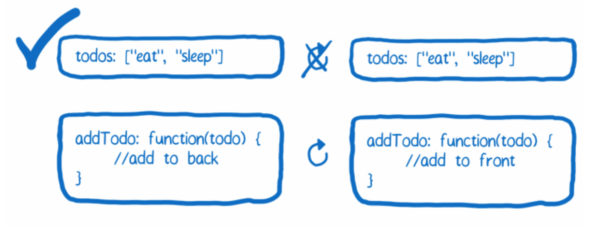

### Problem 2: The state is being rewritten with every action 

In time travel debugging, you keep track of each version of a state object. That way, you can go back to an earlier state.

Each time the state is changed, you need to add the old state to an array of previous state objects. But because of the way JavaScript works, simply adding the variable to the array won’t work. This doesn’t create a snapshot of the object, it just creates a new pointer to the same object.

To make it work, each version needs to be an entirely separate object so that you aren’t accidentally changing past versions.

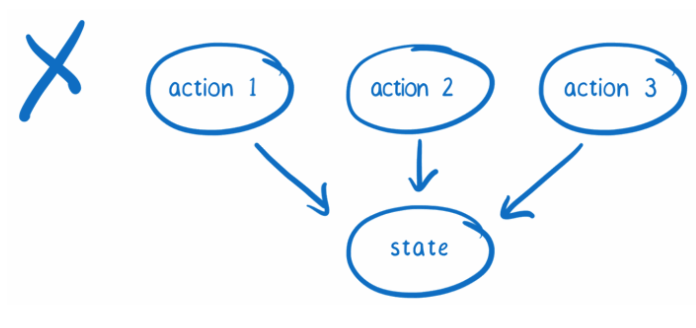

**Solution**  
When an action comes in to the store, don’t handle it by changing the state. Instead, copy the state and make changes to the copy.

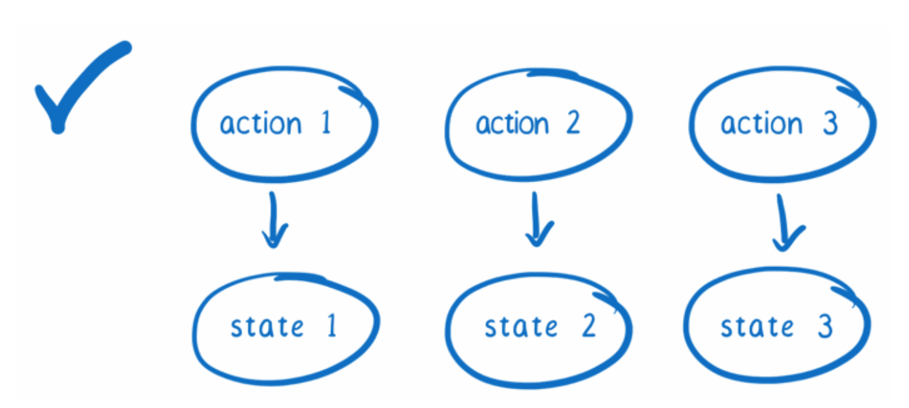

### Problem 3: There aren’t good places for third-party plugins to jump in 

When you’re making developer tools, you need to be able to write them generically. A user should be able to just drop the tool in without having to custom fit their own code around it.

For this to work, you need extension points… places where the code expects to have things added to it.

An example is logging. Let’s say you want to console.log\(\) every action as it comes in, and then console.log\(\) the state that results from it. In Flux, you’d have to subscribe to the dispatcher’s updates and to updates from each store. But that’s custom code, not something a third-party module can easily do.

**Solution**  
Make it easy to wrap parts of the system in other objects. These other objects add their bit of functionality on top of the original. You can see these kinds of extension points in things like “enhancers” or “higher order” objects, as well as middleware.

In addition, use a tree to structure the state change logic. This makes it so the store only emits one event to notify the views that the state has changed. This event comes after the whole state tree has been processed.

_Note: With these problems and solutions, I‘m focusing on the developer tooling use case. These changes help in other use cases, too. On top of that, there are other differences between Redux and Flux. For example, Redux also reduces boilerplate and it makes it easier to reuse logic in the store. Here’s a list of some other_ [_upsides to Redux_](http://stackoverflow.com/a/32920459)_._

So let’s see how Redux makes these things possible.

## The new cast of characters 

The cast of characters changes a little bit from Flux to Redux.

### Action creators 

Redux keeps the action creator from Flux. Whenever you want to change the state of the application, you shoot off an action. That’s the only way that the state should be changed.

 Think of the action creator as a telegraph operator. You go to the action creator knowing basically what message you want to send, and then the action creator formats that in a way that the rest of the system can understand.

Unlike Flux, action creators in Redux do not send the action to the dispatcher. Instead, they return a formatted action object.

### The store 

I described stores in Flux as over-controlling bureaucrats. All state changes must be made personally by a store and have to go through the action pipeline, instead of being requested directly. The store in Redux is still controlling and bureaucratic, but it’s a little bit different.

In Flux, you can have multiple stores. Each store has its own little fiefdom, and it is in total control. It holds on to its little slice of state, and has all the logic for changing that little slice of state.

The Redux store tends to delegate more. And it has to. In Redux, there is only one store… so if it did everything itself, it would be taking on too much work.

Instead, it takes care of holding on to the whole state tree. It then delegates the work of figuring out what state changes need to happen. The reducers, headed up by the root reducer, take on this task.

You might have noticed there’s no dispatcher. That’s because, in a bit of a power grab, the store has also taken over dispatching.

### The reducers 

When the store needs to know how an action changes the state, it asks the reducers. The root reducer takes charge and slices the state up based on the state object’s keys. It passes each slice of state to the reducer that knows how to handle it.

Think of the reducers as a department of white-collar workers who are a little overzealous about photocopying. They don’t want to mess anything up, so they don’t change the state that has been passed in to them. Instead, they make a copy and make all their changes on the copy.

This is one of the key ideas of Redux. The state object isn’t manipulated directly. Instead, each slice is copied and then all of the slices are combined into a new state object.

The reducers pass their copies back to the root reducer, which pastes the copies together to form the updated state object. Then the root reducer sends the new state object back to the store, and the store makes it the new official state.

If you have a small application, you might only have one reducer making a copy of the whole state object and making its changes. Or if you have a large application, you might have a whole tree of reducers. This is another difference between Flux and Redux. In Flux, the stores aren’t necessarily connected to each other and they have a flat structure. In Redux, the reducers are in a heirarchy. This hierarchy can have as many levels as needed, just like the component hierarchy.

### The views: smart and dumb components 

Flux has controller views and regular views. The controller views act as middle managers, managing the communication between the store and their child views.

In Redux, there’s a similar concept: smart and dumb components. The smart components are the managers. They follow a few more rules than the controller views, though:

* Smart components are in charge of the actions. If a dumb component underneath them needs to trigger an action, the smart component passes a function in via the props. The dumb component can then just treat that as a callback.
* Smart components do not have their own CSS styles.
* Smart components rarely emit DOM of their own. Instead, they arrange dumb components, which handle laying out DOM elements.

Dumb components don’t depend on action files directly, since all actions are passed in via props. This means that the dumb component can be reused in a different app that has different logic. They also contain the styles that they need to look reasonably good \(though you can allow for custom styling — just accept a style prop and merge it in to the default styles\).

### The view layer binding 

To connect the store to the views, Redux needs a little help. It needs something to bind the two together. This is called the view layer binding. If you’re using React, this is react-redux.

The view layer binding is kind of like the IT department for the view tree. It makes sure that all of the components can connect to the store. It also takes care of a lot of technical details so that the rest of the hierarchy doesn’t have to understand them.

The view layer binding introduces three concepts:

1. The Provider component: This is wrapped around the component tree. It makes it easy for the root component’s children to hook up to the store using connect\(\).
2. connect\(\): This is a function provided by react-redux. If a component wants to get state updates, it wraps itself using connect\(\). Then the connect function will set up all the wiring for it, using the selector.
3. selector: This is a function that you write. It specifies what parts of the state a component needs as properties.

### The root component 

All React applications have root components. This is just the component at the top level of the component hierarchy. But in Redux applications, this component takes on more responsibility.

The role it plays is kind of like a C-level executive. It puts all of the teams in place to tackle the work. It creates the store, telling it what reducer to use, and brings together the view layer binding and the views.

The root component is pretty hands-off after it initializes the app, though. It doesn’t get caught up in the day-to-day concerns of triggering rerenders. It leaves that to the components below it, assisted by the view layer binding.

## How they all work together 

Let’s see how these parts work together to create a functioning app.

### The setup 

The different parts of the app need to be wired up together. This happens in setup.

1. **Get the store ready.** The root component creates the store, telling it what root reducer to use, using createStore\(\). This root reducer already has a team of reducers which report to it. It assembled that team of reducers using combineReducers\(\).

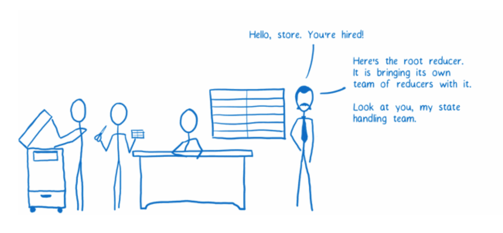

2. **Set up the communication between the store and the components.** The root component wraps its subcomponents with the provider component and makes the connection between the store and the provider.

The Provider creates what’s basically a network to update the components. The smart components connect to network using connect\(\). This ensures they’ll get state updates.

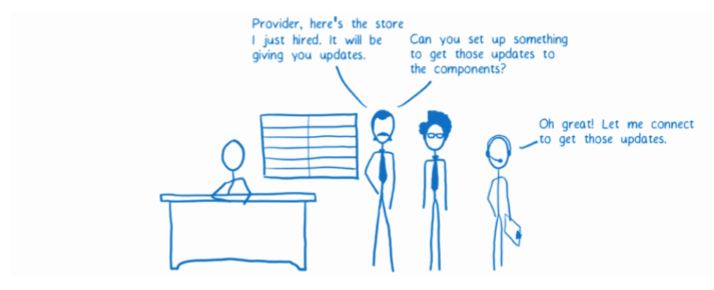

3. **Prepare the action callbacks.** To make it easier for dumb components to work with actions, the smart components can setup action callbacks by using bindActionCreators\(\). This way, they can just pass down a callback to the dumb component. The action will be automatically dispatched after it is formatted.

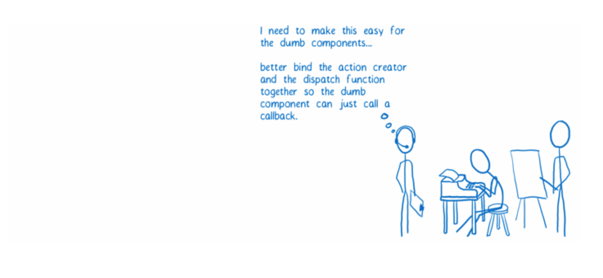

### The data flow 

Now that the application is set up, the user can start interacting with it. Let’s trigger an action to see the data flow.

1. The view requests an action. The action creator formats it and returns it.

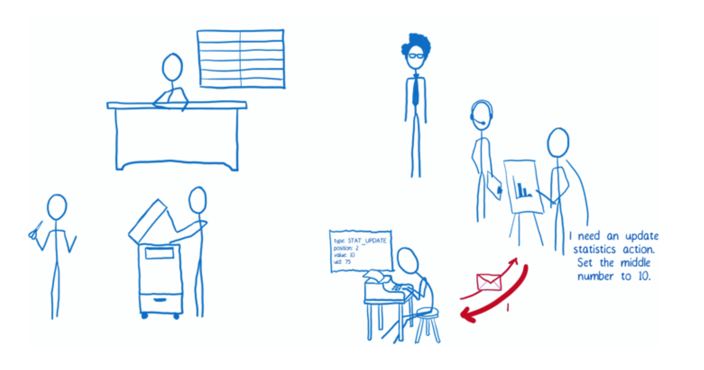

2. The action is either dispatched automatically \(if bindActionCreators\(\) was used in setup\), or the view dispatches the action.

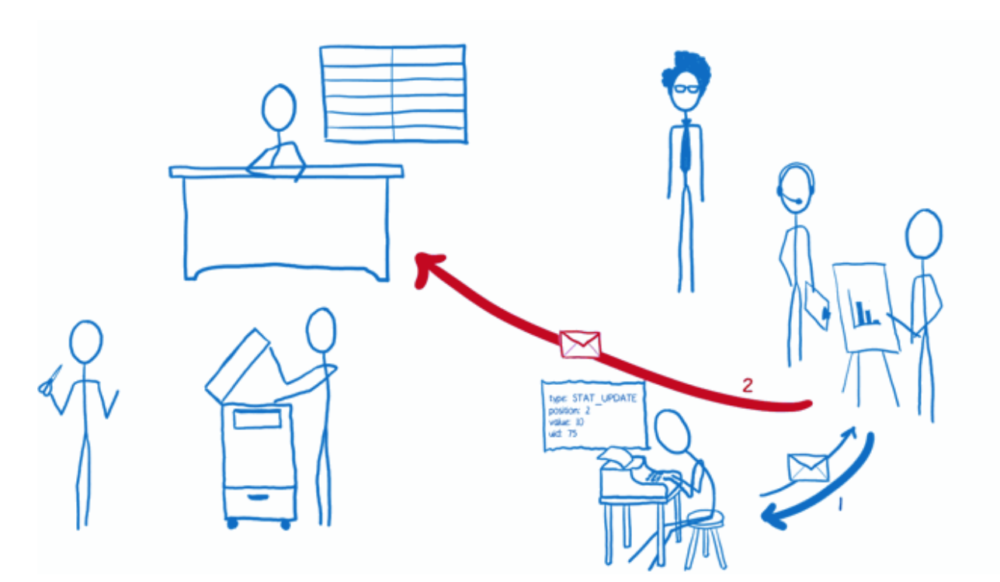

3. The store receives the action. It sends the current state tree and the action to the root reducer.

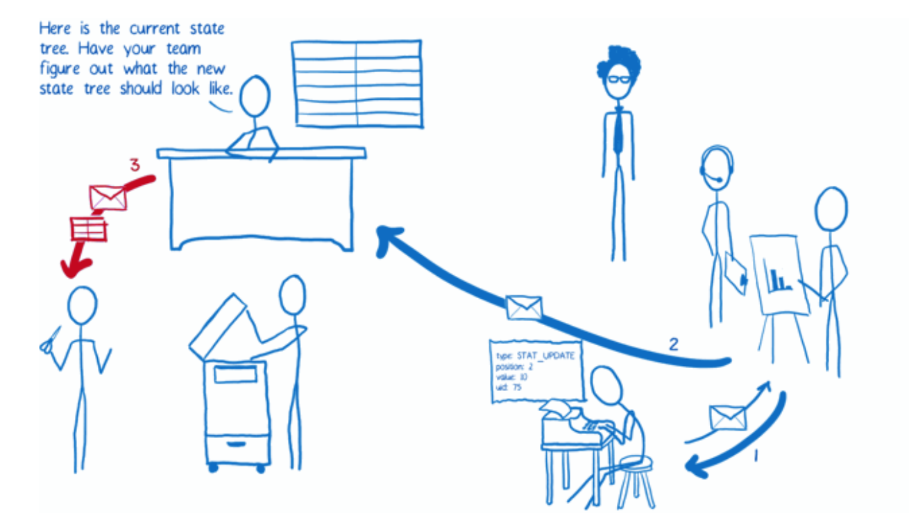

4. The root reducer cuts apart the state tree into slices. Then it passes each slice to the subreducer that knows how to deal with it.

5. The subreducer copies the slice and makes changes to the copy. It returns the copy of the slice to the root reducer.

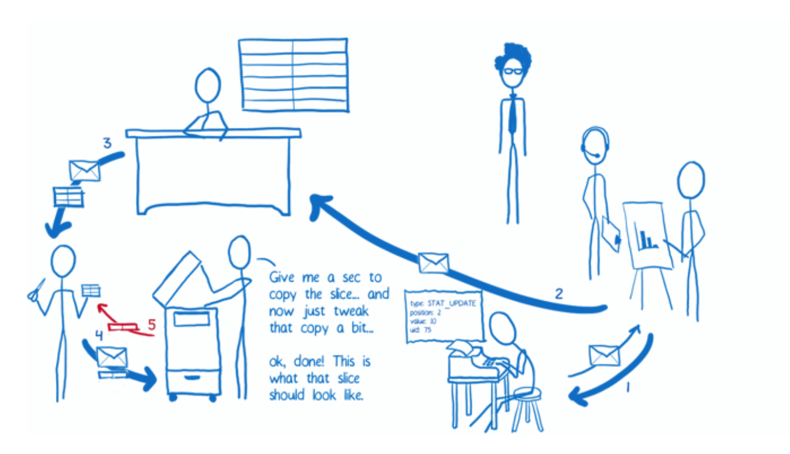

6. Once all of the subreducers have returned their slice copies, the root reducer pastes all of them together to form the whole updated state tree, which it returns to the store. The store replaces the old state tree with the new one.

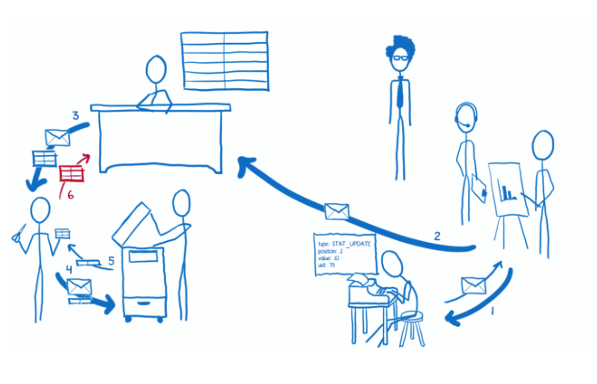

7. The store tells the view layer binding that there’s new state.

8. The view layer binding asks the store to send over the new state.

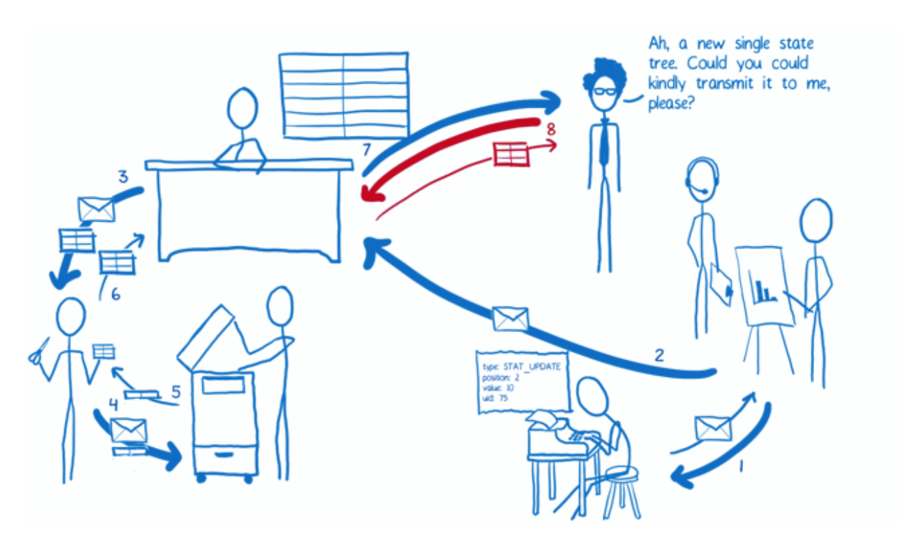

9. The view layer binding triggers a rerender.

