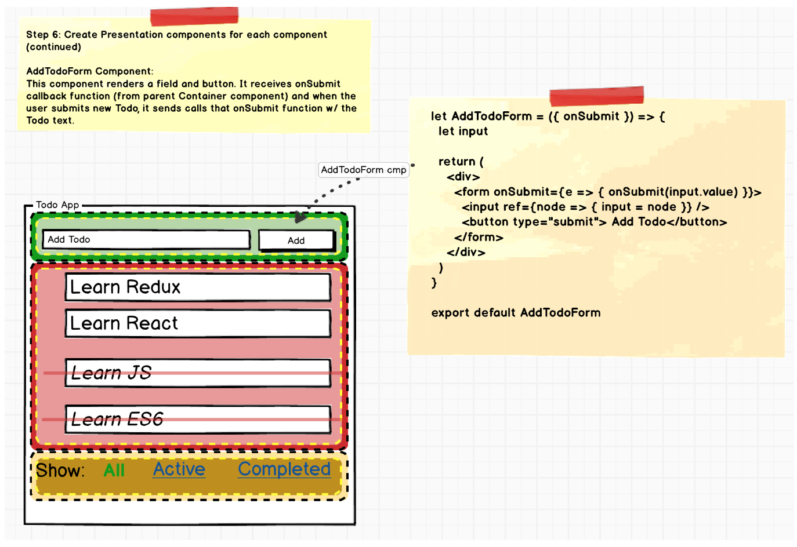

# Building React Redux Apps

Redux is becoming the de facto way to build React apps. And there are tons of examples that show how it’s done. But React-Redux apps have too many parts like: “Reducers”, “Actions”, “Action Creators”, “State”, “Middleware” and more\). It could be overwhelming!

## Why Redux? <a id="950f"></a>

React — A JS library that helps us to divide up our app into multiple components but doesn’t clearly specify how to keep track of the data\(aka State\) and how to deal with all the events\(aka Actions\) properly.

Redux — A complimentary library to React that provides a way to easily keep the data\(State\) and the events\(Actions\).

> **Essentially Redux allows us to build React app as you are but delegate all the State and Actions to Redux**

Let’s get started:

## STEP 1 — Write A Detailed Mock of the Screen <a id="04cc"></a>

Mock should include all the data and visual effects \(like strikethrough the TodoItem, or “All” filter as a text instead of a link\)

> _**Please Note: You can click on the pictures to Zoom**_


## STEP 2 — Divide The App Into Components <a id="3f18"></a>

Try to divide the app into chunks of components based on their overall “**purpose**” of each component.

We have 3 components “AddTodo”, “TodoList” and “Filter” component.


## **Redux Terms: “Actions” And “States”** <a id="6556"></a>

_**Every component does two things:**_  
1. Render DOM based on some data. This data is called as a“**state**”.  
2. Listen to the user and other events and send them to JS functions. These are called “**Actions**”.

## STEP 3 — List State and Actions For Each Component <a id="2305"></a>

Make sure to take a careful look at each component from STEP 2, and list of States and Actions for each one of them.

We have 3 components “AddTodo”, “TodoList” and “Filter” component. Let’s list Actions and States for each one of them.

### 3.1 AddTodo Component — State And Actions <a id="08f7"></a>

In this component, we have no state since the component look and feel doesn’t change based on any data but it needs to let other components know when the user creates a new Todo. Let’s call this action “**ADD\_TODO**”.


### 3.2 TodoList Component — State And Actions <a id="72a1"></a>

TodoList component needs an array of Todo items to render itself, so it need a state, let’s call it **Todos** \(Array\). It also needs to know which “Filter” is turned on to appropriately display \(or hide\) Todo items, it needs another state, let’s call it “**VisibilityFilter**” \(boolean\).

Further, it allows us to toggle Todo item’s status to completed and not completed. We need to let other components know about this toggle as well. Let’s call this action “**TOGGLE\_TODO**”


### 3.3 Filter Component — State And Actions <a id="4f9c"></a>

Filter component renders itself as a Link or as a simple text depending on if it’s active or not. Let’s call this state as “**CurrentFilter**”.

Filter component also needs to let other components know when a user clicks on it. Let’s call this actions, “**SET\_VIBILITY\_FILTER**”


## Redux Term: “Action Creators” <a id="3237"></a>

Action Creators are simple functions who job is to receive data from the DOM event, format it as a formal JSON “Action” object and return that object \(aka “Action”\). This helps us to formalize how the data/payload look.

Further, it allows any other component in the future to also send\(aka “dispatch”\) these actions to others.

## **STEP 4 — Create Action Creators For Each Action** <a id="66a5"></a>

We have total 3 actions: ADD\_TODO, TOGGLE\_TODO and SET\_VISIBILITY\_FILTER. Let’s create action creators for each one of them.

```text
//1. Takes the text from AddTodo field and returns proper “Action” JSON to send to other components.
export const addTodo = (text) => {
 return {
 type: ‘ADD_TODO’,
 id: nextTodoId++,
 text,  //<--ES6. same as text:text, in ES5
 completed: false //<-- initially this is set to false
 }
} //2. Takes filter string and returns proper “Action” JSON object to send to other components.
export const setVisibilityFilter = (filter) => {
 return {
 type: ‘SET_VISIBILITY_FILTER’,
 filter
 }
} //3. Takes Todo item’s id and returns proper “Action” JSON object to send to other components.
export const toggleTodo = (id) => {
 return {
 type: ‘TOGGLE_TODO’,
 id
 }
}
```

## Redux Term: “Reducers” <a id="6da3"></a>

Reducers are functions that take “state” from Redux and “action” JSON object and returns a new “state” to be stored back in Redux.

 1. Reducer functions are called by the “Container” containers when there is a user action.  
2. If the reducer changes the state, Redux passes the new state to each component and React re-renders each component

```text
For example the below function takes Redux’ state(an array of previous todos), and returns a **new** array of todos(new state) w/ the new Todo added if action’s type is “ADD_TODO”.const todo = (state = [], action) => {
 switch (action.type) {
  case ‘ADD_TODO’:
     return 
       […state,{id: action.id, text: action.text, completed:false}]; 
 }
```

## STEP 5 — Write Reducers For Each Action <a id="af18"></a>

_Note: Some code has been stripped for brevity. Also I’m showing SET\_VISIBILITY\_FILTER along w/ ADD\_TODO and TOGGLE\_TODO for simplicity._

```text
const todo = (state, action) => {
  switch (action.type) {
     case ‘ADD_TODO’:
      return […state,{id: action.id, text: action.text, 
              completed:false}]      case ‘TOGGLE_TODO’:
        return state.map(todo =>
                if (todo.id !== action.id) {
                  return todo
                }
                 return Object.assign({}, 
                    todo, {completed: !todo.completed})
            )       case ‘SET_VISIBILITY_FILTER’: {
       return action.filter
      }      default:
      return state
    } 
}
```

## Redux Term: “Presentational” and “Container” Components <a id="cb1f"></a>

Keeping React and Redux logic inside each component can make it messy, so Redux recommends creating a dummy presentation only component called “Presentational” component and a parent wrapper component called “Container” component that deals w/ Redux, dispatch “Actions” and more.

 The parent Container then passes the data to the presentational component, handle events, deal with React on behalf of Presentational component.


_**Legend**_: Yellow dotted lines = “Presentational” components. Black dotted lines = “Container” components.

## STEP 6 — Implement Every Presentational Component <a id="dea0"></a>

It’s now time for us to implement all 3 Presentational component.

### _6.1 — Implement AddTodoForm Presentational Component_ <a id="437e"></a>



### 6.2 — Implement TodoList Presentational Component <a id="2507"></a>


### 6.3 — Implement Link Presentational Component <a id="b0c4"></a>


Note: In the actual code, **Link** presentational component is wrapped in “**FilterLink**” container component. And then 3 “FilterLink” components are then displayed inside “Footer” presentational component.

## STEP 7 — Create Container Component For Some/All Presentational Component <a id="7c9a"></a>

It’s finally time to wire up Redux for each component!

### 7.1 Create Container Component — AddTodo <a id="2709"></a>


### 7.2 Create Container Component — TodoList Container <a id="97e9"></a>


### 7.3 Create Container Component — Filter Container <a id="f5c8"></a>


_Note: In the actual code,_ _**Link**_ _presentational component is wrapped in “**FilterLink**” container component. And then 3 “FilterLink” components are then arranged and displayed inside “**Footer**” presentational component._

## STEP 8 — Finally Bring Them All Together <a id="a049"></a>

```text
import React from ‘react’ // ← Main React library
import { render } from ‘react-dom’ // ← Main react library
import { Provider } from ‘react-redux’ //← Bridge React and Redux
import { createStore } from ‘redux’ // ← Main Redux library
import todoApp from ‘./reducers’ // ← List of Reducers we created //Import all components we created earlier
import AddTodo from ‘../containers/AddTodo’
import VisibleTodoList from ‘../containers/VisibleTodoList’
import Footer from ‘./Footer’ // ← This is a presentational component that contains 3 FilterLink Container comp//Create Redux Store by passing it the reducers we created earlier.
let store = createStore(reducers)render(
 <Provider store={store}> ← The Provider component from react-redux injects the store to all the child components
 <div>
 <AddTodo />
 <VisibleTodoList />
 <Footer />
 </div>
 </Provider>,
 document.getElementById(‘root’) //<-- Render to a div w/ id "root"
)
```

